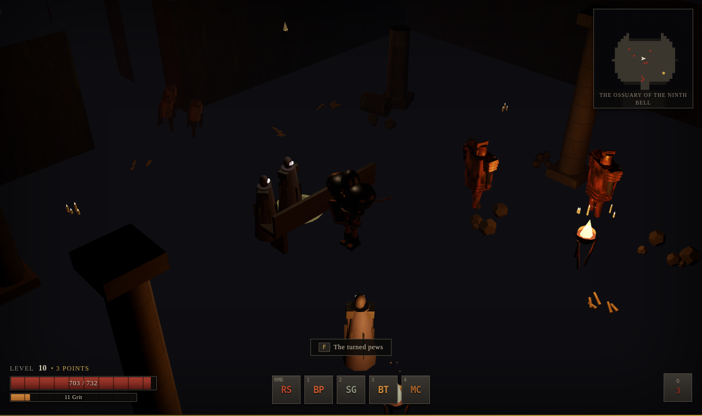
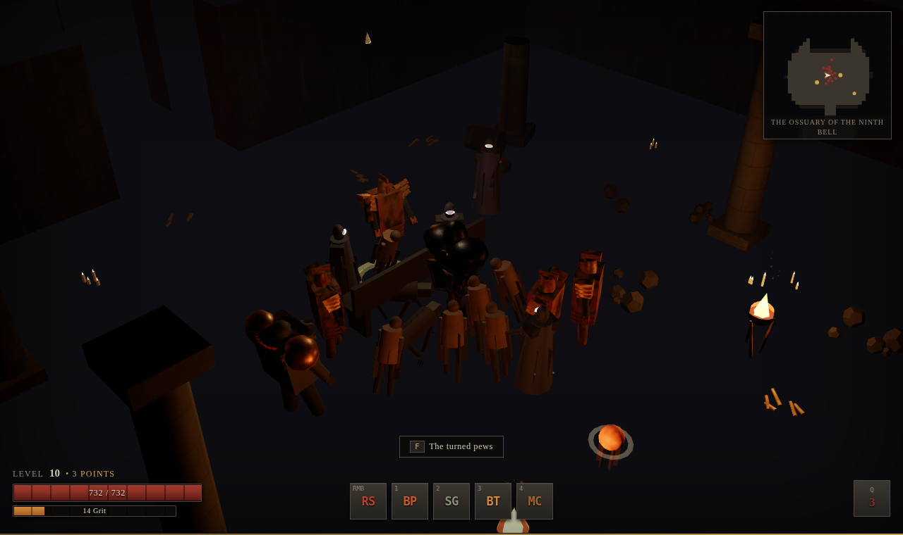
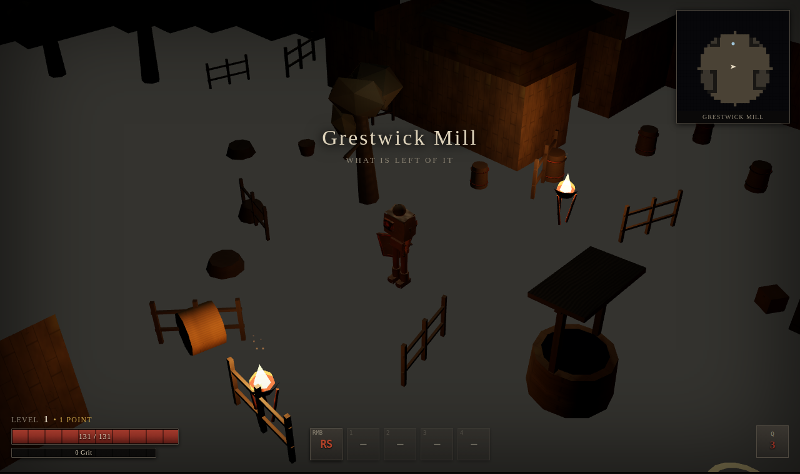
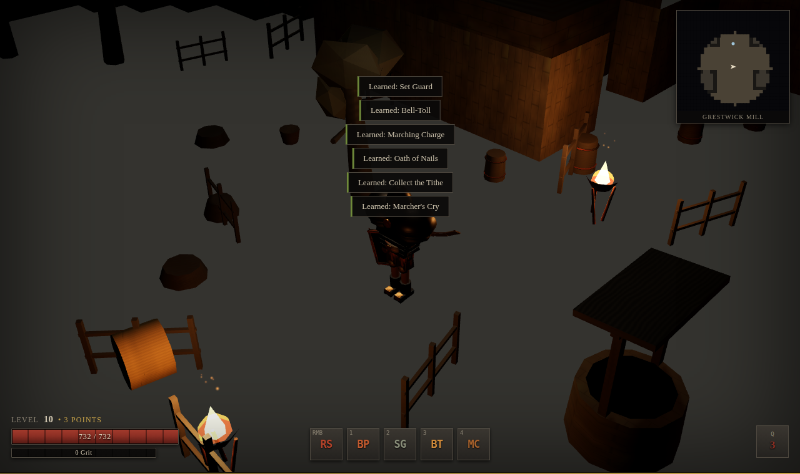

# OSSUAN — The Ninth Bell

A dark fantasy isometric action RPG. Original world, original systems, no
third-party assets of any kind.

> **Working title:** PROJECT CHACOX. The project is now named for its setting.

| | |
| --- | --- |
|  |  |
| *The Ossuary of the Ninth Bell* | *A fight in the nave* |
|  |  |
| *Grestwick Mill, the hub* | *Equipment is visible on the character* |

All four images are the game's own output, captured by `node tools/shots.mjs`.

---

## Play it

```bash
npm install
npm run build:hosted
# then open dist-single/ossuan.html
```

That produces a **single ~780 KB HTML file** with the whole game inlined.
Double-click it — no server, no install, no network. It is verified to boot and
play straight off disk.

To develop instead:

```bash
npm run dev          # http://127.0.0.1:5173
```

There is no engine to install, no asset download and no platform build step —
the game runs in any browser with WebGL 2. See
**[docs/HOSTING.md](docs/HOSTING.md)** for deploying it, including the
GitHub Pages workflow that ships with the repository.

| Command | What it does |
| --- | --- |
| `npm run dev` | Development server with hot reload |
| `npm run build` | Typecheck, then produce a static build in `dist/` |
| `npm run preview` | Serve the production build on port 4173 |
| `npm test` | 115 tests over the simulation, including an automated playthrough (headless, no browser) |
| `npm run typecheck` | TypeScript only |
| `npm run smoke` | **Boots the real build in headless Chromium and plays it**, checking 45 runtime behaviours and writing screenshots |
| `npm run shots` | Capture beauty shots of specific scenarios |
| `npm run build:hosted` | Single-file and artifact builds for hosting |

To deploy, run `npm run build` and serve `dist/` as static files. There is no
backend.

---

## Controls

| Input | Action |
| --- | --- |
| **Left click** | Move to a point, or attack the target under the cursor |
| **Right click** | Primary skill, aimed at the cursor |
| **1 – 4** | Bound skills |
| **Q** | Healing draught |
| **F** | Interact (chests, shrines, exits, vendors, lore) |
| **I** | Pack (inventory) |
| **C** | Character sheet |
| **K** or **S** | Disciplines (skills) |
| **M** or **Tab** | Toggle minimap zoom |
| **Shift** (held) | Compare a hovered item against what you have equipped |
| **Space** | Stop moving |
| **Esc** | Menu (save, load, options) |
| **F1** | Developer overlay |

With the developer overlay open: `F2` spawn, `F3` spawn elite, `F4` drop an
item, `F5` grant XP, `F6` god mode, `F7` clear enemies, `F8` teleport to cursor,
`F9` spawn the boss, `` ` `` cycle zones.

---

## What is in the vertical slice

- **Three archetypes** — Ironbound, Pallwalker and Ashen, each with its own
  resource economy, 8 skills, starting kit and body build.
- **Three zones** — Grestwick Mill (hub), the Tallow Marches (outdoor region)
  and the Ossuary of the Ninth Bell (dungeon), ending in a three-phase boss.
- **11 enemy types** across three families, plus 7 elite modifiers that change
  behaviour rather than just colour.
- **47 base items**, 30 multi-tier affixes, 4 rarities and 10 gameplay-changing
  reliquary effects.
- **Grid inventory** with drag, swap and side-by-side comparison, and equipment
  that visibly changes the character model.
- Levels 1–10, XP, skill points, a skill tree, save/load, fog-of-war minimap,
  procedural audio and a full VFX layer.

See **[docs/GAME_DESIGN.md](docs/GAME_DESIGN.md)** for the world and systems,
and **[docs/TECHNICAL_ARCHITECTURE.md](docs/TECHNICAL_ARCHITECTURE.md)** for how
it is built.

---

## Project structure

```
src/
  core/        Engine-agnostic primitives: seeded RNG, typed event bus,
               fixed-timestep clock, FSM, object pool, ID registry
  data/        All content as data: items, affixes, skills, enemies,
               elites, archetypes, special effects
  sim/         The entire game simulation. Imports NO rendering code.
  world/       Zone definitions, level-building primitives, zone runtime
  render/      Three.js layer: scene, terrain, camera, VFX, and the
               procedural geometry and texture generators
  ui/          DOM overlay: HUD, panels, tooltips, minimap
  audio/       WebAudio synthesis
  save/        Versioned, ID-addressed save format
  game.ts      Wires every layer together and owns the main loop
tests/         Vitest suites over src/sim and src/world
tools/         smoke.mjs (runtime verification), shots.mjs (screenshots)
docs/          Design, architecture, art direction, asset pipeline
```

**The important structural rule:** `src/sim/` never imports from `src/render/`
or `src/ui/`. The renderer reads simulation state each frame and never writes
to it. That is why the whole game can be tested in Node without a browser, and
why the simulation could later be moved to a server without rewriting it.

---

## Dependencies

Three runtime/dev dependencies, all permissively licensed:

| Package | Licence | Why |
| --- | --- | --- |
| `three` | MIT | WebGL rendering |
| `vite` | MIT | Dev server and bundler |
| `typescript` | Apache-2.0 | Language |
| `vitest` | MIT | Tests |
| `playwright` | Apache-2.0 | Drives the browser for `npm run smoke` |

**There are no art, audio, font or data assets from any third party.** Every
mesh, texture, animation and sound in this game is generated in code at
runtime. See [THIRD_PARTY_ASSETS.md](THIRD_PARTY_ASSETS.md).

---

## Requirements

- Node 18+ to build
- A browser with **WebGL 2** to play
- No GPU strictly required (the automated test suite runs on SwiftShader
  software rendering), but a GPU is strongly recommended for playable frame
  rates

---

## Licence

Original work. The world, systems, names and code in this repository are
original; see [docs/GAME_DESIGN.md](docs/GAME_DESIGN.md) for the design
lineage and what was deliberately *not* borrowed.
